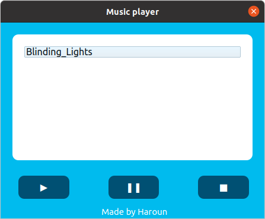

# OGG_Music_Player_PYQT5

A standard music player program written in python.

By default, the program searches for songs in the current directory of the code, you can change it easily.

**Prerequisites:**
- Python 3
- PyQt5
- Pygame

**How to run**
`$ python3 musicPlayer.py`                

Result:

